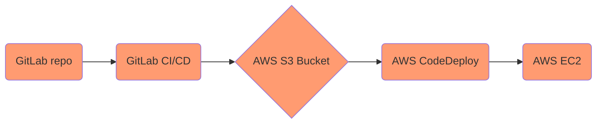

# Acebook on AWS

## Kick-off

1. We'll discuss about the important things for the week
2. We'll have a short Q&A
3. You'll get into your teams and run through the [project setup](#project-setup)

## Overview of the week

- You'll work in teams to build your own CI-CD solution and to deploy an existing application using different AWS services (Your coach will announce the teams on Slack.)
- You'll organise your own work based on the goals for the week
- There will be a session about IAM on AWS and perhaps a session about Amazon ECS, depending on the progress on the week project
- There will be a retro on Friday

## Goals for the week

You are already familiar with these questions, but it's important to bear them in mind:

* Are you having fun?

* Are you a better DevOps engineer than you were yesterday?

By the end of the week, the goal is to be able to answer "yes" to the week's primary questions:

* **Do you have a solid knowledge of IAM in AWS? You can explain the following concepts: users, groups, policies and roles**
* **Can you work as part of a team to build your own CI-CD solution using GitLab CI/CD?**
* **Can you work as part of a team to deploy an existing application on EC2?**
* **Can you apply security best practices around credentials and token storage?**

## Application Architecture

### Project Setup

1. One member in your group, fork the following [GitLab repository](https://gitlab.com/makers-students/acebook-node-template). Yes, it's Acebook with Node!
2. Add the other members of your group as collaborators.
3. Make sure the project is correctly set up and running locally.
4. Make a copy for your group of this [Trello board](https://trello.com/b/vEU6ix2I/acebook-on-aws-dwp).
5. Work through the cards on the board and have fun!

### Bonus: Amazon ECS

If we have time this week, we'll have a [session](https://gitlab.com/makers-students/devops-course/-/tree/main/workshops/week-3/amazon_ecs.md) about ECS (Elastic Container Service) on AWS.

### Supporting Materials

You can find the different supporting materials on the specific Trello board cards.
