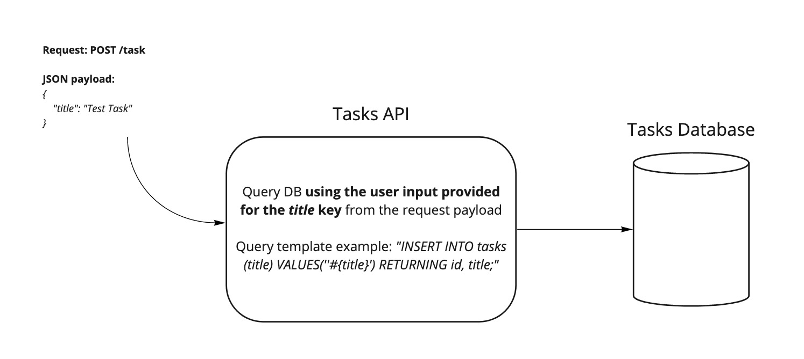

# Introduction to Threat Modelling (TM)

## Learning Objectives
- Learning what TM is
- Learning why TM is important
- Learning when to TM
- Learning how to apply a generic 4-question framework for TM

## Introduction: What is TM?
- :question: What does first come to your mind when you hear `Threat Modelling`?

## Why TM?
- :question: Why do we want to apply TM practices? Think about the potential benefits!

## When to TM? Best practices
- :question: When would it be the best time to apply TM?
- :question: When would it be a good idea to update our threat models?

## Applying a 4-question TM framework
The following 4-question framework should help us to organise threat modelling in order to mitigate potential significant risks from threats.

- :question: What are we building?
- :question: What can go wrong?
- :question: What are we going to do?
- :question: Did we do well?

## Demo: Applying a 4-question TM framework

Your coach will demonstrate applying the framework with a short, practical exercise.

## Practice: TM

Albus, in an effort to collaborate with the team more closely on their tasks, has put together the following diagram
and shared it with the team for a new product we need to build.

Despite being a very wise human being, Albus estimated this task would take a couple of hours at most and that no additional meetings would need to be held.

However, your task is to prove Albus wrong and raise any security concerns that may arise if not taken into account when designing the above system.

As part of this task, you only have information about the first question (*What are we working on?*) from the 4-question TM framework you've just seen in the demo.

- :question: Can you work through the remaining questions and apply the full TM framework?

## What's next?

:rocket: Take a deep breath, put your hacker hat on and proceed to the [Threat Modelling Exercises](../../security/threat-modelling-challenges.md) :old_key:

### Resources
- [Threat Modelling by OWASP](https://owasp.org/www-community/Threat_Modeling)
- [Threat Modelling Process by OWASP](https://owasp.org/www-community/Threat_Modeling_Process)

### Other Supporting Materials
- [Threat Modelling at Microsoft](https://www.microsoft.com/en-us/securityengineering/sdl/threatmodeling)
- [Secure DevOps Starts with Threat Modelling Software](https://threatmodeler.com/secure-devops-starts-with-threat-modeling/)
- [Threat modelling and DevOps: 3 lessons from the front lines](https://techbeacon.com/security/threat-modeling-devops-3-lessons-front-lines)
